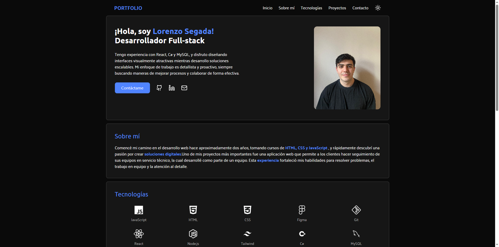

# Portfolio Personal

¡Hola! Bienvenido a mi portafolio personal. Este proyecto es una muestra de mis habilidades, experiencia y los proyectos en los que he trabajado. Está diseñado para ser limpio, moderno y completamente responsivo.



## Tecnologías

Este portafolio ha sido construido con tecnologías modernas para asegurar rendimiento y mantenibilidad:

-    **React**
-    **Vite**
-    **Tailwind CSS**
-   **Lucide React** (para íconos)

## Características

-   **Diseño Responsivo**: Se adapta perfectamente a móviles, tablets y escritorio.
-   **Modo Oscuro/Claro**: Soporte nativo para preferencia de tema del sistema o cambio manual.
-   **Alto Rendimiento**: Carga rápida gracias a Vite.
-   **Secciones Clave**:
    -   **Inicio**: Introducción.
    -   **Sobre Mí**: Resumen de experiencia y habilidades.
    -   **Proyectos**: Galería de trabajos con enlaces a demos y código.
    -   **Contacto**: Formas fáciles de conectar.

## Instalación y Uso

Si deseas clonar y ejecutar este proyecto localmente:

1.  **Clonar el repositorio**
    ```bash
    git clone https://github.com/lorenzosegada/portfolio.git
    cd portfolio
    ```

2.  **Instalar dependencias**
    ```bash
    npm install
    ```

3.  **Correr el servidor de desarrollo**
    ```bash
    npm run dev
    ```

4.  **Construir para producción**
    ```bash
    npm run build
    ```

## Contacto

¿Te gustó lo que viste? ¡Hablemos!

-   **LinkedIn**: [Lorenzo Segada Lopez](https://www.linkedin.com/in/lorenzo-segada-lopez/)
-   **Email**: [lorenzosegada@gmail.com](#)
-   **GitHub**: [lorenzosegada](https://github.com/lorenzosegada)

---
Hecho con ❤️ por Lorenzo Segada Lopez
